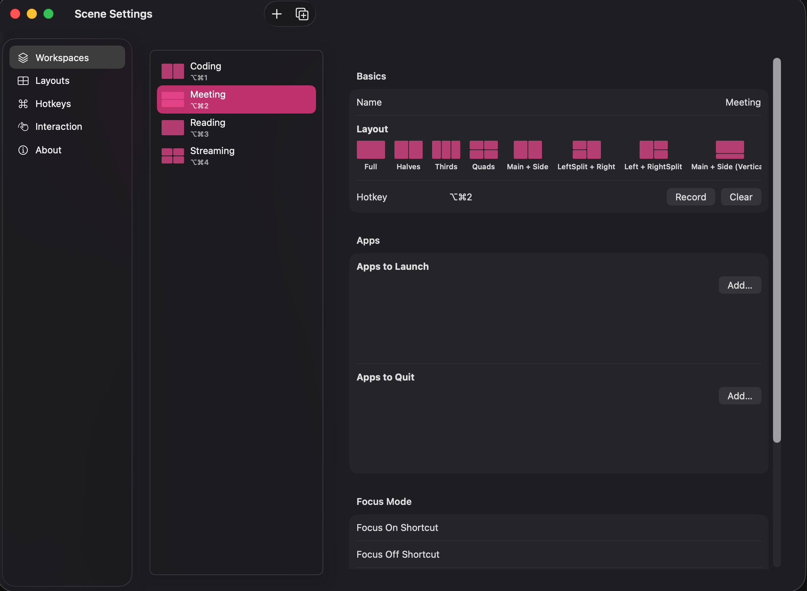
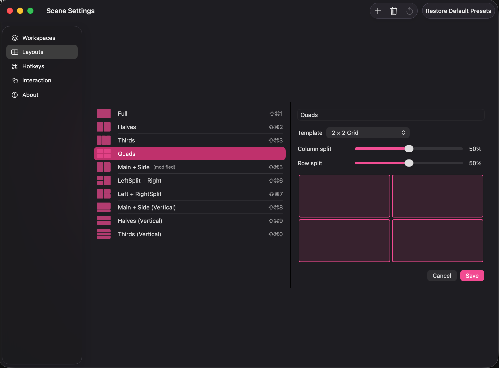

# Scene

> One click. Your windows snap, your apps launch, your Focus mode kicks in. Like [Rectangle](https://rectangleapp.com) for snap layouts — but with **Workspaces** that bundle apps + layout + Focus mode together, and **auto-triggers** that fire when you connect a monitor, hit a scheduled time, or join a calendar event.

A free, open-source macOS menu bar window manager. Native Swift, zero dependencies, notarized by Apple. Requires macOS 14 (Sonoma) or later. Universal binary — runs native on both Apple Silicon and Intel.

[](LICENSE) [](https://www.apple.com/macos/) [](https://github.com/ChiFungHillmanChan/macbook-resizer/releases/latest) [](https://github.com/ChiFungHillmanChan/macbook-resizer/releases/latest) [](https://github.com/ChiFungHillmanChan/macbook-resizer/stargazers)



> 繁體中文版本：[README.zh-HK.md](README.zh-HK.md)

## Why Scene?

Scene's differentiators in a crowded category:

|                                                   | Scene         | [Rectangle](https://rectangleapp.com) | [Magnet](https://magnet.crowdcafe.com) | [Loop](https://github.com/MrKai77/Loop) | [Moom](https://manytricks.com/moom) |
| ------------------------------------------------- | :-----------: | :-----------------------------------: | :------------------------------------: | :-------------------------------------: | :---------------------------------: |
| Price                                             | Free          | Free                                  | $7.99                                  | Free                                    | $10                                 |
| Open source                                       | Yes           | Yes                                   | No                                     | Yes                                     | No                                  |
| Snap-to-edge layouts                              | ✓             | ✓                                     | ✓                                      | ✓                                       | ✓                                   |
| Custom layout builder                             | ✓ tree-split  | —                                     | —                                      | —                                       | ✓                                   |
| **Workspaces** (apps + layout + Focus, one click) | ✓             | —                                     | —                                      | —                                       | partial                             |
| **Auto-triggers** (monitor / time / calendar)     | ✓             | —                                     | —                                      | —                                       | —                                   |
| Drag-to-swap windows                              | ✓             | —                                     | —                                      | —                                       | —                                   |
| 繁體中文 (HK / TW)                                | ✓             | —                                     | —                                      | —                                       | —                                   |

If you only need snap-to-edge tiling, Rectangle is great. If you want one click that switches your entire context — apps, layout, Focus mode, with optional auto-triggers — that's Scene.

## Install

**Homebrew** (recommended):

```bash
brew install --cask chifunghillmanchan/tap/scene
```

Quarantine is stripped automatically — no "cannot be verified" prompt. On first launch, grant Accessibility in **System Settings → Privacy & Security → Accessibility**.

**Or download the DMG directly**: **[Scene-0.7.3.dmg](https://github.com/ChiFungHillmanChan/macbook-resizer/releases/download/v0.7.3/Scene-0.7.3.dmg)** (Universal: Apple Silicon + Intel, macOS 14+, notarized by Apple — no Gatekeeper prompt)

All versions: [Releases page](https://github.com/ChiFungHillmanChan/macbook-resizer/releases) · DMG users, see [`docs/INSTALL.md`](docs/INSTALL.md) for the one-time Gatekeeper + Accessibility-permission steps.

## Demo

[](docs/media/scene-marketing.mp4)

▶ [Watch the 30-second demo](docs/media/scene-marketing.mp4) (MP4, 13 MB)

## What's new in v0.7.3

**Re-applying a layout no longer disturbs windows already in place** — close one window out of your Quads, open a different app, and click Quads again: the three windows still in their slots stay exactly where they are, and only the new window moves into the freed slot. Previously every window was re-mapped by z-order, so one small change reshuffled the whole screen. Drag-swapped positions survive re-applies too.

**The menu bar dropdown stays open while you use it** — clicking Free Mode, a layout, or a workspace no longer dismisses the menu, so you can toggle Free Mode off and fire a layout in one visit. Checkmarks now update live in front of you. The panel closes when you click outside it, press Escape, or open Settings. Tests: 363 → 371.

For the full version history, see [`CHANGELOG.md`](CHANGELOG.md).

## Features

- **10 built-in layout presets** — Full, Halves, Thirds, Quads, Main + Side (70/30), LeftSplit + Right, Left + RightSplit, plus vertical variants: Main + Side (Vertical), Halves (Vertical), Thirds (Vertical)
- **Build your own layouts** — 11 grid templates (columns / rows / 2×2 / 3×2 / 4 L-shape variants) with proportion sliders
- **Per-layout custom hotkeys** with conflict detection (block-save: one chord per layout or workspace)
- **Smooth window animation** with adjustable duration (100–500 ms) and easing (Linear / Ease Out / Spring)
- **Settings window** — Workspaces / Layouts / Hotkeys / Interaction / About (open via menu bar icon → Settings… or ⌘,)
- **One click, all windows** — frontmost window goes to slot 1, the rest follow z-order
- **Sticky re-apply** — windows already sitting in a slot stay put when you re-fire the same layout; only unplaced windows move
- **Overflow handling** — windows beyond slot count get minimized
- **Electron-aware** — retries ±5 px corrections for Cursor, VS Code, Slack, etc.
- **Multi-display** — only rearranges windows on the screen under the mouse
- **Dock/menu-bar-aware** — uses `visibleFrame` so windows never slide under the menu bar or Dock
- **Animation perf safety** — falls back to instant placement when 7+ windows are visible
- **Zero external dependencies** — pure Foundation, AppKit, SwiftUI, Carbon

## Layouts

| ID | Name | Slots |
|---|---|---|
| 1 | Full | 1 (100%) |
| 2 | Halves | 2 (50/50) |
| 3 | Thirds | 3 equal columns |
| 4 | Quads | 2×2 grid |
| 5 | Main + Side | 70% / 30% |
| 6 | LeftSplit + Right | left column split top/bottom, right column full |
| 7 | Left + RightSplit | left column full, right column split top/bottom |
| 8 | Main + Side (Vertical) | top row 70%, bottom row 30% |
| 9 | Halves (Vertical) | 2 equal rows |
| 10 | Thirds (Vertical) | 3 equal rows |

## Build from source

### Prerequisites

- macOS 14+
- Xcode 16+ (for building the app — free from the Mac App Store)
- Swift 5.9+ (bundled with Xcode)

### Build via Xcode

```bash
git clone <repo-url>
cd macbook-resizer
open SceneApp/SceneApp.xcodeproj
```

In Xcode, select the `SceneApp` scheme and press ⌘R. The app runs as a menu bar extra (no Dock icon).

### Build a distributable DMG

```bash
./scripts/build-dmg.sh 0.7.3    # produces dist/Scene-0.7.3.dmg (universal, notarized)
```

This builds a universal (arm64 + x86_64) binary, Developer ID-signs it, submits it to Apple for notarization, and packages it into a DMG with an `Applications` drop shortcut. Both Apple Silicon and Intel Macs install from the same DMG. Set `SKIP_NOTARY=1` for a local ad-hoc build that skips the Apple notary submission (useful while iterating on DMG layout).

### Run the core library tests

The layout logic lives in `SceneCore`, a Swift package that works without Xcode:

```bash
swift test
```

363 unit tests cover layout math, window-to-slot mapping, animation state machine, JSON persistence, hotkey conflicts, drag-to-swap logic, seam reflow, custom-layout tree round-trip, diagnostics writer + sanitizer, semver comparison for the update nudge, and edge cases.

## Usage

1. On first launch, Scene asks for **Accessibility permission**. Grant it in System Settings → Privacy & Security → Accessibility.
2. Click the Scene icon in the menu bar (`rectangle.3.group`) to see the 10 layout presets and 4 workspace presets.
3. Click any layout preset, or press ⌘⌃1 – ⌘⌃0 (where ⌘⌃0 = the 10th). Workspaces fire on ⌘⌥1 – ⌘⌥4.
4. Quit via the menu's **Quit Scene** item.

### Hotkey reference

| Shortcut | Layout |
|---|---|
| ⌘⌃1 | Full |
| ⌘⌃2 | Halves |
| ⌘⌃3 | Thirds |
| ⌘⌃4 | Quads |
| ⌘⌃5 | Main + Side |
| ⌘⌃6 | LeftSplit + Right |
| ⌘⌃7 | Left + RightSplit |
| ⌘⌃8 | Main + Side (Vertical) |
| ⌘⌃9 | Halves (Vertical) |
| ⌘⌃0 | Thirds (Vertical) |

Workspace hotkeys (defaults):

| Shortcut | Workspace |
|---|---|
| ⌘⌥1 | Coding |
| ⌘⌥2 | Meeting |
| ⌘⌥3 | Reading |
| ⌘⌥4 | Streaming |

All layout and workspace hotkeys are re-bindable in Settings → Hotkeys; chord conflicts across layouts **and** workspaces are blocked at save time.

## Automation (v0.7+)

Scene exposes two automation surfaces that any tool can drive:

### URL scheme

```bash
open "scene://workspace/Coding"               # activate workspace by name
open "scene://workspace/Friday%20review?force=1"   # bypass Free Mode
open "scene://layout/Halves"                  # apply layout
open "scene://free-mode/toggle"               # toggle Free Mode
```

Works from Terminal, Raycast script commands, Alfred file actions, Stream Deck "Open URL" buttons, Keyboard Maestro, and any other URL-aware tool.

### Shortcuts.app + Siri (macOS 14.1+)

Scene registers 5 AppIntents that appear in Shortcuts.app under the "Scene" section:

- **Activate Workspace** — fire a workspace by picker selection
- **Apply Layout** — apply a layout to the active screen
- **List Workspaces** — return names as a string array (chain into other actions)
- **Toggle Free Mode**
- **Set Free Mode** (Bool param)

The actions iCloud-sync to Shortcuts on iPhone, iPad, and Apple Watch. Voice command works via Siri:

- "Hey Siri, activate Scene workspace Coding"
- "Hey Siri, apply Scene layout Halves"
- "Hey Siri, toggle Scene Free Mode"

> AppIntents require macOS 14.1+. URL scheme works on all Scene-supported macOS versions (14.0+).

### Edge-case behavior

| Scenario | Behavior |
|---|---|
| More windows than slots | First N placed by z-order; remainder minimized |
| Fewer windows than slots | Windows placed; extra slots left empty |
| No visible windows | macOS notification (or menu bar icon blink if notifications are denied) |
| Permission revoked mid-session | Menu bar icon greys out; hotkeys unregister within 2 s |
| Electron apps | Single ±5 px retry if the window undershoots/overshoots the target |
| System Settings | macOS enforces a minimum window size — position is respected, size may not be |

## Architecture

```
macbook-resizer/
├── Package.swift
├── Sources/SceneCore/          # pure logic, unit-testable without Xcode
│   ├── AX/                     # Accessibility API wrappers
│   ├── Animation/              # Clock, FrameInterpolator, AnimationRunner
│   ├── Display/                # screen picker
│   ├── Interaction/            # HotkeyManager, DragSwapController,
│   │                           #   WindowAnimationSink, WindowMoveObserving
│   ├── Layout/                 # Slot, Layout, LayoutEngine, Plan, Geometry,
│   │                           #   LayoutTemplate, CustomLayout, PresetSeeds, LayoutStore
│   ├── Settings/               # AnimationConfig, HotkeyBinding, DragSwapConfig,
│   │                           #   SettingsStore, Cancellable
│   └── Workspace/              # Workspace, WorkspaceTrigger, WorkspaceSeeds,
│                               #   WorkspaceStore, FocusModeReference
├── Tests/SceneCoreTests/       # 363 XCTest cases
├── SceneApp/                   # Xcode project — menu bar shell + settings window
│   └── SceneApp/
│       ├── Animation/                 # WindowAnimator (CVDisplayLink + AX bridge)
│       ├── Interaction/               # AXMoveObserverGroup, AXWindowLookup,
│       │                              #   DragSwapAnimationSink
│       ├── Resources/                 # Localizable.xcstrings, InfoPlist.xcstrings
│       ├── Settings/                  # SettingsWindowController + 5 tabs
│       │                              #   (Workspaces / Layouts / Hotkeys / Interaction / About)
│       │                              #   + LayoutEditorView + LayoutPickerView + LayoutThumbnail
│       │                              #   + WorkspaceEditorView + WorkspaceTriggerEditor
│       │                              #   + AppPickerView + HotkeyCaptureView
│       ├── Stores/                    # LayoutStoreViewModel, SettingsStoreViewModel,
│       │                              #   WorkspaceStoreViewModel
│       ├── Workspace/                 # AppLauncher, FocusController, WorkspaceActivator
│       │   └── Triggers/              #   MonitorTriggerWatcher, TimeTriggerScheduler,
│       │                              #   CalendarTriggerWatcher, TriggerSupervisor
│       ├── SceneAppApp.swift          # @main + MenuBarExtra
│       ├── AppDelegate.swift
│       ├── Coordinator.swift          # orchestration layer
│       ├── MenuBarContentView.swift
│       ├── OnboardingView.swift
│       ├── OnboardingWindowController.swift
│       └── NotificationHelper.swift
└── docs/
    ├── INSTALL.md                     # end-user install walkthrough
    ├── TESTING.md                     # manual smoke-test checklist (V0.1–V0.5)
    └── media/                         # demo video + screenshots
```

The split is deliberate: `SceneCore` is framework-neutral and owns all the hard logic (AX calls, layout math, hotkey plumbing, animation state machine, JSON persistence, drag-swap, seam reflow, diagnostics). 363 unit tests run via `swift test` without Xcode. `SceneApp` is a thin SwiftUI/AppKit shell — only UI, app lifecycle, and the AppKit/AX bridges (`WindowAnimator`, `AXMoveObserverGroup`, `AXWindowLookup`, `DragSwapAnimationSink`) that can't live in a framework-neutral library. Only the final `.app` build needs Xcode.

## Persistence

Scene writes three JSON files atomically into:

```
~/Library/Application Support/Scene/
├── layouts.json      # 10 seeds + your custom layouts + each layout's hotkey
├── settings.json     # animation enabled/duration/easing + drag-swap config
└── workspaces.json   # 4 workspace seeds + your custom workspaces + active workspace ID
```

Delete this folder to reset to factory state.

## Roadmap

- **Per-display layouts** — apply different presets to each monitor independently.
- **Pattern learning** — observe manual window arrangements and suggest presets ("you usually split 70/30 in the afternoon — save?").
- **AI / natural-language input** — type "cursor left, chrome right" → LLM → layout JSON.
- **Per-app rules** — e.g., "always put Slack in slot 4".
- **Launch-at-Login** UI.
- **Free-form canvas-drag** layout editor (the EpycZones approach).

## License

MIT — see [`LICENSE`](LICENSE).
